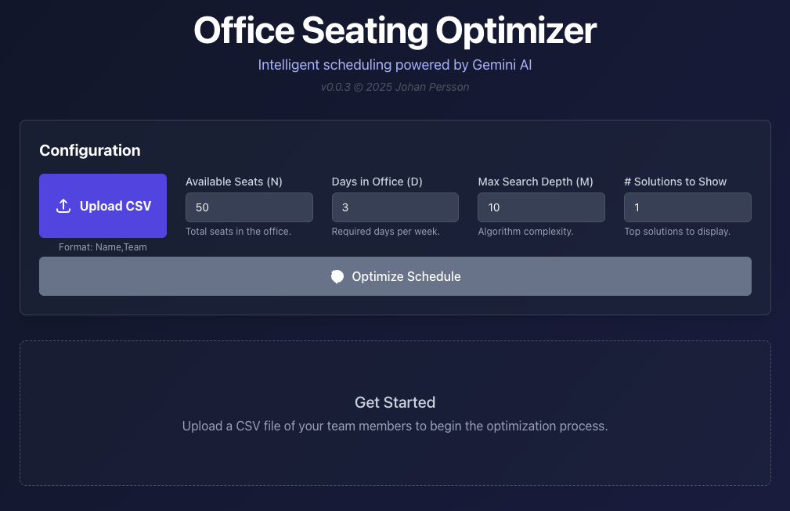

# Seating AI Optimization


# 1. Introduction

This solves the following organization seating optimization problem using Google Gemini AI:

1. The organization demands attendence in office *D* days during weekdays
2. The organization has *N* seats available (which are in general less than the number of people in the organization)
3. All staff is part of one team
4. All members in the same team are in the offce the same days
5. Each team can select on day they prefer not to be in the office

The solution is then a combination of teams and days that adhere to the above constraints.




*Fig 1: Main landing page* 

&nbsp;

&nbsp;


# 2. Getting started

***This will need a valid Gemini AI API way to work! A Google Account is therefore necessary.
Google offers free tier API keys that are good enough for casual use although
there is risk that the free tier of the model is overloaded from time to time.
A paid subscription will get the answer faster and with much less risk of 
the server being overloaded.***
 

## 2.1 Getting a free tier Gemini AI API Key

The free version is enough for this application aas long as it is acceptable that 
from time to time you may get a message that the server is overloaded and to try again. 
There is also a paid tier with much higher limits meaning you get the answer faster 
and are very unlikely to get a message about server overload.

To get a free key:

1. Goto [https://ai.google.dev/gemini-api/docs](https://ai.google.dev/gemini-api/docs) and log-in using your Google Account
2. Click the button `Get a Gemini API Key` 

Follow the instruction and you will get a key. Store that in a safe place. You will shortly need it.

We suggest you add the key as a an environmental variable initialized from a shell script
either `.zshenv` (or `.bashenv`)

Create a variable by adding the following line

```zsh
export GEMINI_API_KEY="your-api-key"
```

## 2.2 Running the program

There are basically two ways you can run this program, the hard and the easy way.

* [**Harder**] If your are a developer or are interesting in looking at the code then clone the repository and setup a build environment
* [**Easy**] If you just want to run the program install `podman` and just pull down the ready made image and start it as shown below

## 2.3  THE EASY WAY: Run directly from pre-built container

This assumes familiarity with container technology. We recommend installing `podman`
Using this method there is no need to clone the repository.

To download the pre-built container using Podman, run the following command:

```bash
$ podman pull ghcr.io/johan162/office-seating-optimizer:latest
```

We assume your `GEMINI_API_KEY` is available as an environmental variable. The container is then
run as so:


```bash
podman run -d -p 8080:80 -e VITE_API_KEY=$(GEMINI_API_KEY) --name office-optimizer office-seating-optimizer:latest
```

This will start the application and serve it at `localhost:8080` ,  open a browser to that URL to start using the program.


## 2.4 [THE HARDER WAY] Running from a cloned repo

### 2.4.1 Installing and running from source using Node dev server

Start by cloning the repo and change to the newly created directory

```bash
$ git clone https://github.com/johan162/office-seating-optimizer.git
$ cd office-seating-optimizer
```

Then setup the Node development library dependencies

```bash
$ npm install
```

This is implemented as a React application using Node.js.  To get started on a local dev setup 
you need to setup a environment file with your Gemini API Key

Create a file in the project root `env.local` and place he following variable in it

```bash
VITE_GEMINI_API_KEY="your-api-key"
```

replace the placeholder text with your actual GEMINI_API_KEY. 

> [!WARNING] This is not a shell script file so you cannot put a reference to your environment variable in here!

You can now start the local dev server as so:

```bash
$ npm start dev
```

This will start a local server and print information on which port and IP-address the server is available
(usually `localhost:3000`)

Open a Web-browser at the given address to start using the program.


### 2.4.2 Building and running a local container

> [!NOTE] This assumes your environmenta variable with your Gemini API Key is available!

This is easiest done with the included `Makefile` in one step:

```bash
make c-run
```

The container is setup to serve the the local site at `localhost:8080`


### 2.4.3 [Optional] Building a production version and running the optimized version

There is a third way built-in to node/reacy and that is to run the optimized compiled version
directly. This is similair to starting a dev server but instead uing the
pre-compiled optimized typescript (from the `dist/` folder) that is created by the `npm build` 
command as such:

```bash
$ make build
$ make preview
```

This will run a local optimized app. The IP-address and port served will be displayed as info message.
For a multi-homed server there migh be multiple addresses. Pick any!


## 3. Implementation

The implementation is a small React based UI wrapper 
on top of Google Gemini AI call. The program does not by itself implement any optimization algorithm.

The detailed prompt that is sent to the Google Gemini AI server is as follows:

```
You are an expert in combinatorial optimization. Your task is to solve an office space scheduling problem.

Here are the constraints and goals:
- Total available office seats (N): ${seats}
- Required number of office days per week for each team (D): ${daysInOffice}
- Your algorithm's maximum search depth (M): ${maxDepth}
- Number of solutions to return: ${numSolutions}

Here are the teams to schedule:
${teamDetails}

Your task is to assign exactly ${daysInOffice} weekdays (Monday-Friday) to each team, subject to the following rules:

1. All members of a single team must be in the office on the same days.
2. The total number of people (sum of team sizes) in the office on any given day cannot exceed the available seats (N).
3. The primary optimization goal is to MINIMIZE the number of teams assigned to their "Least Favorable Day". A team is penalized if one of its assigned office days is its least favorable day. The total count of such teams is the solution's "score". A lower score is better.

Simulate a search for the best solutions using a method analogous to dynamic programming with backtracking. Explore the solution space up to the specified search depth (M) to find the globally optimal solutions.

Return the top ${numSolutions} best solutions you find, sorted by the score (lowest first). For each solution, provide the team assignments, the final score, and the calculated daily headcount.
Provide your answer in the specified JSON format.
```


# Appendix A - CSV Input file format

The purpose of the input CSV file is to list names and team. Each row has a name, followed by a team name. The names and teams are separated by a ','

Exmaple CSV file:
```CSV
Person01,Team1
Person02,Team2
Person03,Team3
Person04,Team4
Person05,Team1
Person06,Team2
Person07,Team3
Person08,Team4
Person09,Team1
Person10,Team2
Person11,Team3
Person12,Team4
Person13,Team1
Person14,Team2
Person15,Team3
Person16,Team4
```


